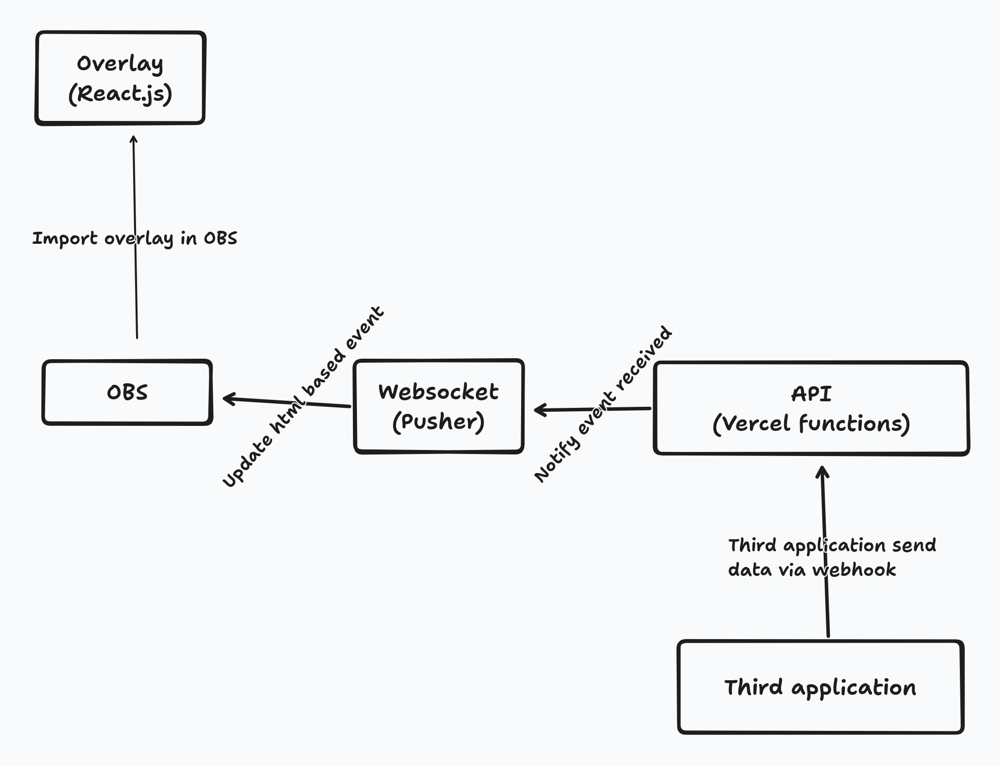

## ABOUT

The project has goal understand how to works the overlay used on livestream.

## TECHNOLOGIES

- Backend
  - Golang
  - Pusher
  - Vercel functions
- Frontend
  - React.js
  - Pusher
- EXTRA TOOLS
  - OBS(open source tool to do live streaming)

## ARCHITECTURE

## INSTRUCTIONS TO RUN THE PROJECT LOCALLY

- Clone
- Execute command **cd backend-go**
- Install the vercel cli
- Create **.env** file based **.env.example**
- Execute command **vercel dev** to run the golang functions locally
- Execute command **cd fronted**
- Create **.env** file based **.env.example**
- Execute command **npm install** to install all packages
- Execute command **npm run start** to start the frontend
